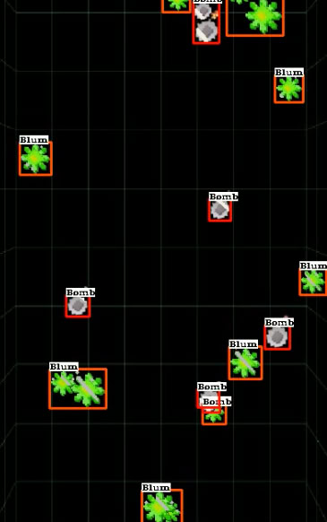

# **BlumBot**: Автоматический помощник для игры Blum

Добро пожаловать в проект **BlumBot** — это развлекательное приложение, созданное для облегчения процесса игры в телеграмм-игру **Blum**. Хотя оно может напоминать читы, на самом деле его главная цель — добавить веселья и динамики в игровой процесс.

## О проекте

**BlumBot** — это автокликер, разработанный специально для тех, кто хочет немного упростить себе задачу в игре Blum. С его помощью можно выполнять рутинные действия в игре, ускоряя игровой процесс. **BlumBot** автоматически взаимодействует с объектами игры, делая ваш игровой опыт более увлекательным и менее утомительным.

Проект был создан не для фарма криптовалюты или получения нечестного преимущества в игре, а исключительно для веселья и личного использования.

## Особенности

- **Автоматизация**: BlumBot автоматически определяет игровые объекты и кликает по ним, позволяя вам расслабиться и наслаждаться игрой.
- **Простота использования**: Запустите программу, и она сама сделает всю работу.
- **Развлекательный аспект**: Программа создана для того, чтобы добавить нотку автоматизации и веселья в игру, без каких-либо серьёзных последствий.

## Платформы

BlumBot работает на следующих платформах:
- **Windows**
- **Linux**
- **macOS**

## Установка

Для того чтобы запустить BlumBot, выполните следующие шаги:

1. Установите зависимости из файла `requirements.txt`:
pip install -r requirements.txt

2. Запустите проект:
python main.py

## Предупреждение

**BlumBot** создан для развлекательных целей. Мы не несем ответственности за любые последствия использования этого приложения. Пожалуйста, используйте его с осознанием того, что это просто забавный способ ускорить игровой процесс.

**Не используйте это для фарма криптовалюты!**

